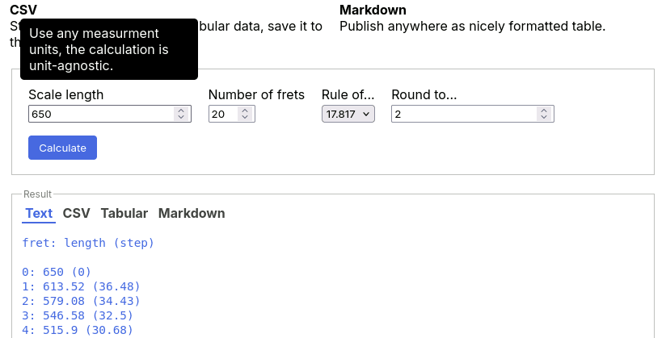

# Yet Another Fret Calculator v1.0

This calculator calculates frets for your instrument and represents the results in convenient formats.

- **Text**: Simple text to copy.
- **CSV**: Standard portable format for tabular data, save it to the file with .csv extension.
- **Tabular**: Copy and paste to your spreadsheet editor.
- **Markdown**: Publish anywhere as nicely formatted table.

Looks like this:

### Planned features

- [ ] Copy to clipboard button.
- [ ] Save to file — csv, dsv, txt, md.
- [ ] Generate nice printable page (image?).
